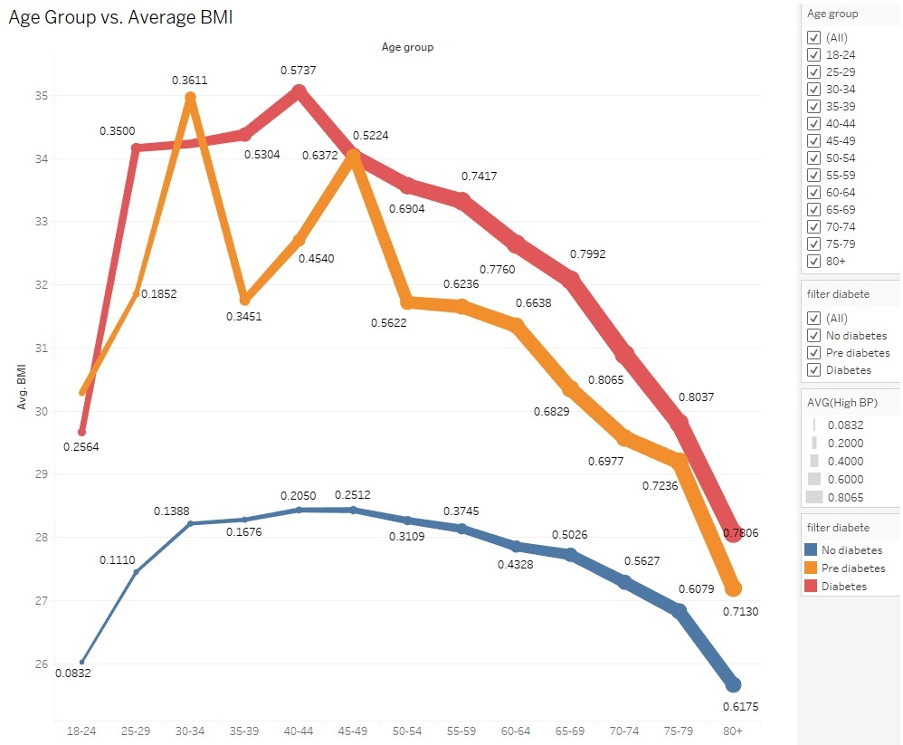
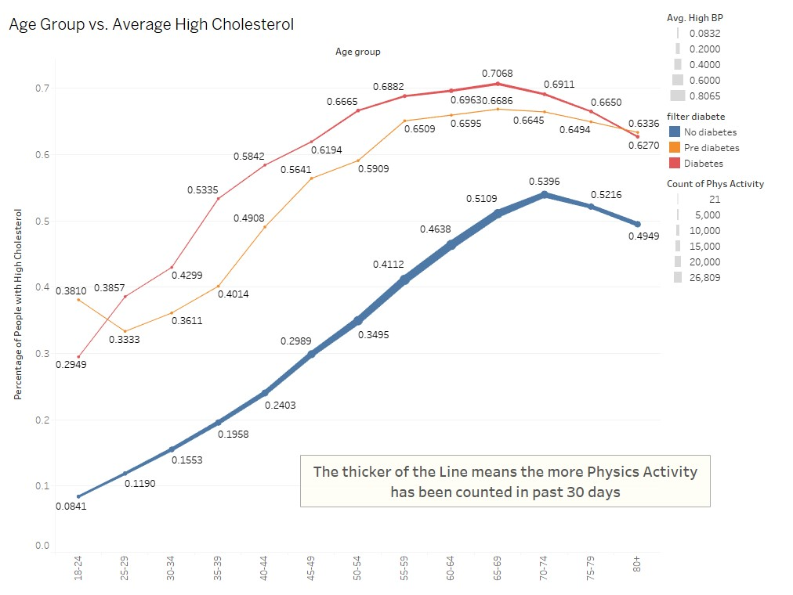

# 🏥 Diabetes Predictor

This project focuses on developing a **predictive model for diabetes classification** based on **health indicators**. Using machine learning techniques, we analyze risk factors such as **BMI, physical activity, cholesterol levels, and blood pressure** to determine whether an individual is **diabetic, pre-diabetic, or non-diabetic**.

---

## 📌 Table of Contents

- [Project Overview](#project-overview)
- [Usage Guide](#usage-guide)
- [Target Variable & Key Features](#target-variable--key-features)
- [Visualizations](#visualizations)
- [Technologies Used](#technologies-used)
- [References](#references)
- [Credits](#credits)
- [License](#license)

---

## Project Overview

The goal of this project is to build a **machine learning model** to predict **diabetes status** (No Diabetes, Pre-Diabetes, Diabetes) using **health-related features**. The dataset contains **key lifestyle and medical indicators** that help in identifying diabetes risk.

- **Goal:** Understand **risk factors contributing to diabetes** for better predictive modeling.  
- **Analyzed Features:**  
  - **Age vs. BMI** (by Diabetes Status)  
  - **High BP vs. High Cholesterol**  
  - **Diabetes Distribution by Key Indicators**  

---

## Usage Guide

### 1. Clone the Repo
To run this project locally, follow these steps:

```bash
git clone https://github.com/AidanDavid/DiabetesPredictor.git
cd DiabetesPredictor
```

### 2. Install Dependencies
Ensure all required Python libraries are installed:

```bash
pip install -r requirements.txt
```

### 3. Train the Model
Before running the web app, you **must generate** the model file. Open Jupyter Notebook and run the training script:

```bash
jupyter notebook
```
- Navigate to `notebooks/train_model.ipynb`
- Run all the cells to **train and save `model.pkl`**

### 4. Run the Web App
Once `model.pkl` is created, launch the Flask app:

```bash
python app.py
```
- Open your browser and go to **[http://127.0.0.1:5000/](http://127.0.0.1:5000/)** to interact with the application.

---

## Target Variable & Key Features

### **Target Variable**
- **Diabetes_012**  
  - `0 = No Diabetes`  
  - `1 = Pre-Diabetes`  
  - `2 = Diabetes`  

### **Key Features**
- **BMI** - Body Mass Index (continuous value)  
- **High Blood Pressure (BP)** - Indicator of hypertension  
  - `0 = No High BP`  
  - `1 = High BP`  
- **High Cholesterol (Chol)** - Indicator of cholesterol levels  
  - `0 = No High Cholesterol`  
  - `1 = High Cholesterol`  
- **Physical Activity** - Engagement in physical activity (excluding job-related activity)  
  - `0 = No`  
  - `1 = Yes`  
- **Age** - Originally, the dataset categorized age into only three broad groups:
  - `1 = 18-24`  
  - `9 = 60-64`  
  - `13 = 80 or older`  
  
  For **better visualization and clarity**, the age groups have been **divided into finer categories** (e.g., 18-24, 25-29, 30-34, etc.), making the trends more interpretable.
- **Sex** - Gender of the individual  
  - `0 = Female`  
  - `1 = Male`  

---

## Visualizations

Explore the **Tableau Public dashboard** (Tableau Public Workbook) to visualize diabetes risk factors:

[](https://public.tableau.com/app/profile/yiheng.sun/viz/diabetes_17406445784920/Story1)

### **How to Use This Visualization**
1. **Click the Tableau Public link** to open the interactive dashboard.  
2. **Use filters** (age group, diabetes status) to explore trends.  
3. **Hover over data points** to view additional insights.  

### **Example Visualizations:**

#### **Age Group vs. Average BMI** (The thicker of the Line means the high Blood Pressure)



#### **Age Group vs. Average High Cholesterol**


🔗 **[View the Full Dashboard Here](https://public.tableau.com/app/profile/yiheng.sun/viz/diabetes_17406445784920/Story1)**  

---

## Technologies Used
- **Python**: For data analysis and visualization.  
- **Pandas**: For data manipulation and aggregation.  
- **Jupyter Notebook**: For executing data science workflows.  
- **Tableau Public**: For interactive data visualization.  

---

## References

### **Data Sources**
- **Kaggle**: [Diabetes Health Indicators Dataset](https://www.kaggle.com/datasets/alexteboul/diabetes-health-indicators-dataset)

---

## Credits

This project was developed by:

👤 **Yiheng Sun**  
- **GitHub**: [@Sait0uAsuka](https://github.com/Sait0uAsuka)

👤 **Aidan David**  
- **GitHub**: [@AidanDavid](https://github.com/AidanDavid)

👤 **Lucas Hejmo Jones**  
- **GitHub**: [@LucasHejmo](https://github.com/LucasHejmo)

---

## License
This project is licensed under the **MIT License**. See the [LICENSE](./LICENSE) file for details.  